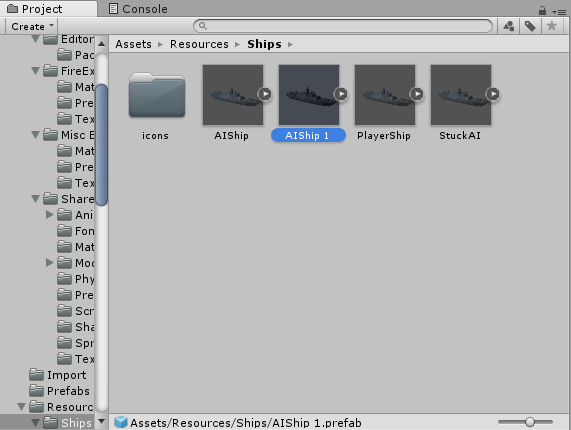
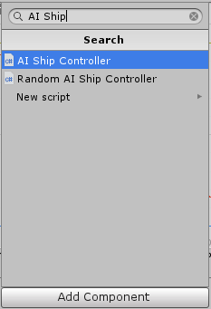

- [AI仕様](#ai仕様)
    - [AIスクリプトに実装すべきメソッド](#aiスクリプトに実装すべきメソッド)
        - [onLoad](#onload)
        - [AIThink](#aithink)
    - [AIスクリプトのクラスで利用可能なプロパティ, 関数](#aiスクリプトのクラスで利用可能なプロパティ-関数)
        - [プロパティ](#プロパティ)
        - [関数](#関数)
            - [攻撃系](#攻撃系)
            - [自動移動回転系](#自動移動回転系)
            - [その他](#その他)
    - [Radarクラス](#radarクラス)
        - [プロパティ](#プロパティ)
    - [ShipDataクラス](#shipdataクラス)
        - [プロパティ](#プロパティ)
    - [BulletDataクラス,TorpedoDataクラス](#bulletdataクラスtorpedodataクラス)
        - [プロパティ](#プロパティ)
    - [Unityの利用ライブラリ](#unityの利用ライブラリ)
        - [Vector3構造体](#vector3構造体)
            - [コンストラクタ](#コンストラクタ)
            - [プロパティ](#プロパティ)
                - [static](#static)
                - [非static](#非static)
            - [関数](#関数)
                - [static](#static)
        - [Quaternion構造体](#quaternion構造体)
        - [Transformクラス](#transformクラス)
            - [プロパティ](#プロパティ)
        - [Mathf構造体](#mathf構造体)
            - [プロパティ](#プロパティ)
            - [関数](#関数)
        - [Timeクラス](#timeクラス)
            - [プロパティ](#プロパティ)
    - [使用禁止の命令](#使用禁止の命令)
    - [AIの作り方](#aiの作り方)
    - [ゲームに登録するには](#ゲームに登録するには)
    - [その他データ](#その他データ)
        - [弾速](#弾速)
        - [大きさ](#大きさ)
  
# AI仕様
移動や攻撃等の処理はAIスクリプトの1つのクラス内で完了できます. 他の船/砲弾/魚雷のデータはRaderクラスからそれぞれ参照できます.
## AIスクリプトに実装すべきメソッド

```cs
protected override void onLoad()
protected override void AIThink()
```

これ以外にもクラス内に自作関数を作っても構いませんが,AIThink関数から呼び出されるまたはAIThink関数が呼び出す関数から呼び出されないと実行されません.

### onLoad
ゲーム開始前に1度だけ実行される.
### AIThink
ゲーム中に繰り返し呼び出される. 呼び出し回数は1秒間に40回. ここでAIの動作を書く.

## AIスクリプトのクラスで利用可能なプロパティ, 関数
### プロパティ

|プロパティ名|オブジェクト型|プロパティの表す内容|
|:-|:-|:-|
|AutoMoveTargetPos|Vector3|船の自動移動先地点の座標|
|AutoRotTargetPos|Vector3|船の自動旋回で向く地点の座標|
|finishedAutoMove|bool|自動移動が終了したかどうか|
|finishedAutoRot|bool|自動旋回が終了したかどうか|
|Speed|float|船の前進/後退スピード(-1~1)|
|RoSpeed|float|船の旋回スピード(-1~1)|
|radar|Radar|Radarクラスのオブジェクト|
|AIThinkCount|int|AIThink関数が通算何回目の呼び出しか|

* 1fのとき次AIThinkが呼び出されるまでに座標1進む.
* 1fのとき次AIThinkが呼び出されるまでに1度回転する.

### 関数
#### 攻撃系

|返り値の型|関数名|引数1(型)|引数2(型)|関数の処理内容|
|:-|:-|:-|:-|:-|
|void|Fire|-|-|全砲門斉射|
|void|Fire|砲門番号(int)|-|指定の砲門から発射|
|void|FireTorpedo|到達目標地点座標(Vector3)|-|魚雷を目標地点に向けて発射|
|bool|isFireable|砲門番号(int)|-|発射する砲弾が自分の船に当たらないかどうか|
|float|getGunCoolTimeLeft|砲門番号(int)|-|指定砲門の残りクールタイムを返す|
|float|getTorpedoCoolTimeLeft|-|-|魚雷の残りクールタイムを返す|

#### 自動移動回転系

|返り値の型|関数名|引数1(型)|引数2(型)|関数の処理内容|
|:-|:-|:-|:-|:-|
|void|AutoMoveToTarget|移動目標地点座標(Vector3)|-|指定座標へ自動移動を開始|
|void|AutoRotateToTarget|船首を向ける地点の座標(Vector3)|-|指定座標に船首が向くように自動旋回を開始|
|void|AutoRotateToTarget|角度(正:右回転,負:左回転)(float)|-|指定角度自動旋回を開始|
|void|AutoGunRotateToTarget|砲門を向ける地点の座標(Vector3)|-|指定座標に砲門が向き続けるように砲門自動旋回＆修正|
|void|StopAutoGunRotation|-|-|砲門の自動旋回&修正を停止|
|void|SetGunRotationSpeed|砲門番号(int)|旋回速度(float)|砲門の旋回速度を設定する|

#### その他
|返り値の型|関数名|引数1(型)|引数2(型)|関数の処理内容|
|:-|:-|:-|:-|:-|
|Transform|getGunTransform|砲門番号(int)|-|砲門のTransformオブジェクトを返す|
|int|getID|-|-|自分の船のIDを返す|
|float|getTime|-|-|ゲーム開始からの経過時間を返す|

## Radarクラス
### プロパティ

|プロパティ名|オブジェクト型|プロパティの表す内容|
|:-|:-|:-|
|OtherShipsData|List<ShipData>|他の船のデータのリスト|
|BulletsData|List<BulletData>|飛行中の砲弾のデータ|
|TorpedoData|List<TorpedoData>|進行中の魚雷のデータ|

## ShipDataクラス
### プロパティ

|プロパティ名|オブジェクト型|プロパティの表す内容|
|:-|:-|:-|
|id|int|船のID|
|hp|int|船のHP|
|position|Vector3|船の現在位置の座標|
|forward|Vector3|船が向いている方向の単位ベクトル|
|quaternion|Quaternion|船の回転情報|


## BulletDataクラス,TorpedoDataクラス
### プロパティ

|プロパティ名|オブジェクト型|プロパティの表す内容|
|:-|:-|:-|
|shipid|int|発射した船のID|
|position|Vector3|砲弾/魚雷の現在位置|
|forward|Vector3|砲弾/魚雷の向いている方向の単位ベクトル|
|quaternion|Quaternion|砲弾/魚雷の向き|

## Unityの利用ライブラリ
### Vector3構造体
3次元ベクトルx,y,z成分を保持. 座標や方向を表す.
#### コンストラクタ
float x, float y, float z
#### プロパティ
##### static

|プロパティ名|オブジェクト型|プロパティの表す内容|
|:-|:-|:-|
|zero|Vector3|0ベクトル(=new Vector3(0,0,0))|
|one|Vector3|各成分1のベクトル(=new Vector3(1,1,1))|
|up|Vector3|y軸上向き長さ1のベクトル(=new Vector3(0,1,0))|

##### 非static

|プロパティ名|オブジェクト型|プロパティの表す内容|
|:-|:-|:-|
|x|float|x成分|
|y|float|y成分|
|z|float|z成分|
|magnitude|float|ベクトルの長さ|
|normalized|Vector3|長さ1にした単位ベクトル|

#### 関数
たくさんあるので一部だけ.[Unityスクリプトリファレンス](https://docs.unity3d.com/ScriptReference/Vector3.html)
##### static

|返り値の型|関数名|引数1(型)|引数2(型)|関数の処理内容|
|:-|:-|:-|:-|:-|
|float|Distance|座標1(Vector3)|座標2(Vector3)|2つの座標間の距離を返す|
|Vector3|Cross|座標1(Vector3)|座標2(Vector3)|2つのベクトルの外積を返す|
|float|Angle|ベクトル1(Vector3)|ベクトル2(Vector3)|２つのベクトルの成す角度を返す(0~180度)|

### Quaternion構造体
回転情報を保持する. 下記以外多分使わないと思います.[Unityスクリプトリファレンス](https://docs.unity3d.com/ScriptReference/Quaternion.html)
[Quaternion.Euler](https://docs.unity3d.com/jp/460/ScriptReference/Quaternion.Euler.html)
[Quaternion.eulerAngles](https://docs.unity3d.com/ja/2017.4/ScriptReference/Quaternion-eulerAngles.html)


### Transformクラス
位置と向きを保持する. 下記以外のプロパティ,関数全ては使わないでください. また, 読み取り専用です.
#### プロパティ

|プロパティ名|オブジェクト型|プロパティの表す内容|
|:-|:-|:-|
|eulerAngles|Vector3|向きの各軸の回転角|
|localEulerAngles|Vector3|船首を基準とした回転角|
|forward|Vector3|前向きの単位ベクトル|
|position|Vector3|座標|
|right|Vector3|右向きの単位ベクトル|
|rotation|Quaternion|回転情報|

### Mathf構造体
数学関係の処理がまとめられたクラス.使いそうなものを下に.全てstaticです.[Unityスクリプトリファレンス](https://docs.unity3d.com/ScriptReference/Mathf.html)

#### プロパティ

|プロパティ名|オブジェクト型|プロパティの表す内容|
|:-|:-|:-|
|Deg2Rad|float|定数:2π/360|
|Epsilon|float|定数:ε|
|Infinity|float|定数:正無限大|
|NegativeInfinity|float|定数:負無限大|
|PI|float|定数:π|
|Rad2Deg|float|360/(2π)|

#### 関数

|返り値の型|関数名|引数1(型)|引数2(型)|引数3(型)|関数の処理内容|
|:-|:-|:-|:-|:-|:-|
|float|Abs|実数1(float)|-|-|実数1の絶対値を返す|
|float|Ceil|実数1(float)|-|-|小数第一位を切り上げした整数を返す|
|float|Clamp|実数1(float)|最小値(float)|最大値(float)|実数1を最大最小の範囲内の値で返す|
|float|Cos|ラジアン角(float)|-|-|cosを返す|
|float|Floor|実数1(float)|-|-|小数第一位を切り下げした整数を返す|
|float|Pow|実数1(float)|指数(float)|-|べき乗を返す|
|float|Round|実数1(float)|-|-|四捨五入した整数を返す|
|float|Sin|ラジアン角(float)|-|-|sinを返す|
|float|Sqrt|実数1(float)|-|-|平方根を返す|
|float|Tan|ラジアン角(float)|-|-|tanを返す|

### Timeクラス
時間関係の定数がまとめられたクラス. 使いそうなものだけ列挙します. [Unityスクリプトリファレンス](https://docs.unity3d.com/ja/2017.4/ScriptReference/Time.html)

#### プロパティ

|プロパティ名|オブジェクト型|プロパティの表す内容|
|:-|:-|:-|
|fixedDeltaTime|float|AIThink関数が実行されてから次AIThink関数が実行されるまでの時間|
|time|float|ゲームが起動してからの経過時間|

## 使用禁止の命令
* 上に書いた命令以外で移動や回転を行う関数
* GameObject.FindやGetComponent<T>()
* Transformの中身を書き換える
* Transformクラスの上記以外のプロパティ及び関数
* timeScaleを書き換える命令

## AIの作り方
how_to_make_AI_scriptを参照.

## ゲームに登録するには

1. プロジェクトを開き, ProjectビューからResources/Shipsフォルダに移動.

2. AIShipという名前のPrefabを選択し, Ctrl + Dを押して複製する.

3. AIShip 1という名前のPrefabができるので, F2を押してわかりやすい名前に変更. これが自分のAIの船のPrefabとなる.
4. InspectorビューのShip StatsコンポーネントのShipNameにAI/船の名前を入れ, Authorに自分のユーザー名を入れる.

5. (Iconには自分の好きな画像のスプライトを設定できる.)
6. Projectビューで適当なフォルダを開き, 右クリックし, Create -> C# Scriptから適当な名前のスクリプトを作成する.

7. 自分の船のPrefabのAIShipControllerコンポーネント右クリックし, Remove Componentから削除する.

8. Inspectorビューの一番下のAdd Componentから自分のAIのスクリプトを追加する.

9. 実行するには, Menuシーンを開いてPlayを押す.

## その他データ
### 弾速

|移動物体|スピード(/call)|
|:-|:-|
|砲弾|2.83|
|魚雷|0.8|
|船(最大船速)|1|

### 大きさ

|物体|サイズ|
|:-|:-|
|船|90.7|
|砲弾|2.2|
|魚雷|7.2|
