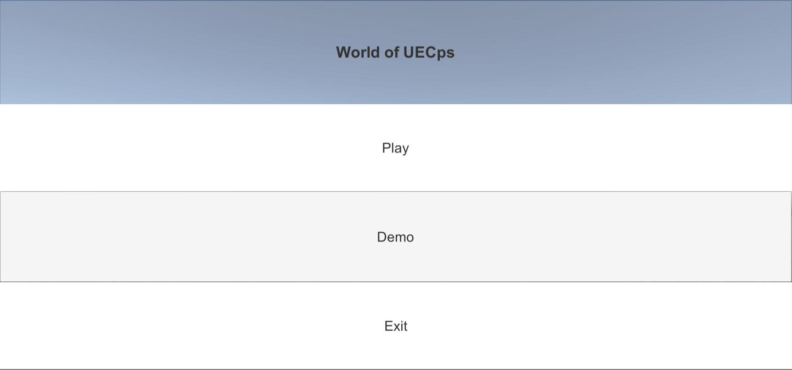
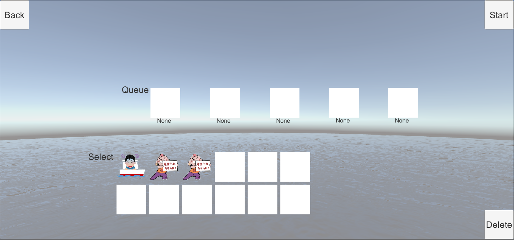
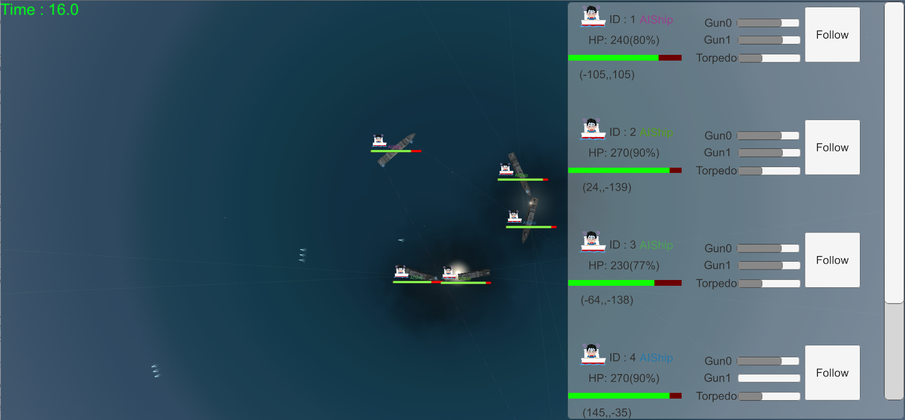
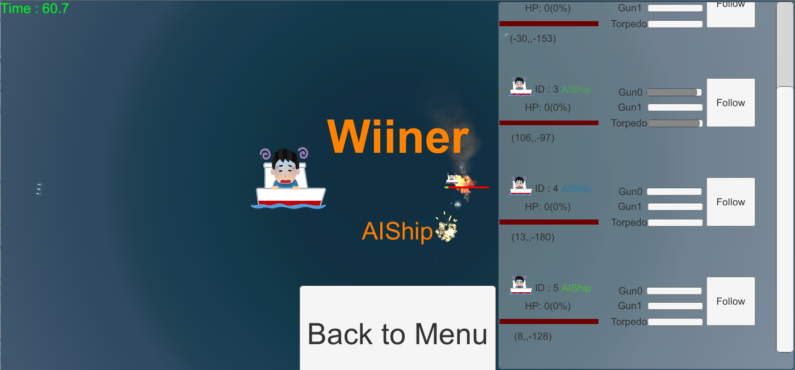

# World of UECps(仮称)
## 概要
 砲門2つを搭載した船が決められたエリアの中に配置され, 砲弾, 魚雷を使って敵を攻撃する海戦3Dアクションゲーム.
## ルール説明
 AIコントロールの船が決められたエリアにランダムに配置されるので, 自分の船をコントロール, 攻撃するAIを作り, 対戦させる. 
### ゲームエリア
 原点中心の1000x1000の正方形のエリア内にランダムにスポーンする. ゲーム中にエリア外に出るとエリア内のランダムな位置に強制的にテレポートする.
### AIが操作できるもの
 船の前進/後退の速度と旋回速度. +1～-1で±1(/degree) / call. 砲門の向きと角度, 魚雷の発射方向
### 攻撃手段
#### 砲弾
 前後に一つずつ搭載された砲門から発射可能. クールタイムは3秒. 10ダメージ.
#### 魚雷
 船の真下から任意の方向に発射可能. 3発同時に発射. クールタイムは10秒. 50ダメージ
## ゲームの流れ

1. AI船がエリア内のランダムな位置に配置
2. ゲーム開始.
3. 1秒間は待機時間(システムの関係上)
4. 1秒後, AI思考開始.
5. AI思考は1秒間に40回行われる
6. 他の船すべて轟沈した時点で生き残っている船が勝利.

## 勝利条件

* 制限時間満了
* 他の船すべて轟沈(HP0)

## AIの作り方

### 環境
Unityの最新版をインストールしてください. Unityインストール
サンプルAIをAIShipController.csに書いてあります.詳しくは別説明へ.
### Unity or 他のOBJ指向言語経験者向け
 ShipControllerクラスを継承し, AIThinkおよびonLoadメソッドをオーバーライドすればOK.

## AIをゲームに登録
### Unity or 他のOBJ指向言語経験者向け
 Resources/Ships配下に自分のAIのスクリプトをアタッチした船のPrefabを置く.
## 操作方法
### メニュー画面
 マウス操作
### ゲーム画面

|ボタン|動作|
|:-|:-|
|マウス右クリック|視点回転(カメラ)|
|マウスホイールクリック|平行移動(カメラ)|
|マウスホイール|前進/後退(カメラ)|
|Tab|GUI表示切り替え|
|Esc|メニューに戻る|
|W|前進(Player)|
|S|後退(Player)|
|A|左回転(Player)|
|D|右回転(Player)|
|Q|前砲門左回転(Player)|
|E|前砲門右回転(Player)|
|Z|後砲門左回転(Player)|
|X|後砲門右回転(Player)|
|Space|砲門斉射(Player)|
|Enter|カメラが向いている角度で魚雷発射(Player)|

## 画面説明
### メニュー画面

Playは通常の,使うキャラクターを選んで対戦させるモード,DemoはEscが押されるまでループで対戦させるモードです.

### 選択画面

Resources/Shipsフォルダ配下にある船が下の一覧にアイコンで表示されます. アイコンをクリックすると上のQueueに追加され, 名前とともに表示されます. Deleteボタンを押すと, 最後に追加した船をQueueから削除します. Backボタンでメニュー画面に戻ります. ２つ以上船を追加したらPlayでゲーム画面に遷移します.
### ゲーム画面

メニュー画面でDemoを押すか,選択画面でPlayを押すと自動的にゲームが始まります. Escキーを押すとメニューに強制転移します.右に各船のステータスが表示されています.これはTabキーを押すと表示/非表示を切り替えられます.

### 勝利画面

最後の船が生き残ると, その船が勝利し, このように表示されます. Back to Menuボタンでメニュー画面に戻ります.

## 利用素材と謝辞
* 船(イージス艦)の3Dモデル: https://free3d.com/3d-model/hamina-35750.html
* エフェクト,環境: Unity Standard Assets
* 効果音: https://soundeffect-lab.info/sound/battle/battle2.html
* 砲弾,魚雷の3Dモデル: Mattsi氏

## 連絡先
バグや不明な点があれば[Twitter@rtc5200](https://twitter.com/rtc5200)にリプライorDMを送るか, Slackでrtc5200.syousaにDMを送ってください. 